# Authentication & RBAC

> **Status:** Proposed — implementation plan. Revised: 2026-09-21.
>
> This document specifies the **target behavior**, not a claim that RBAC is deployed.
> Project filtering, centralized API clients, and a Portal sign-in MVP already exist;
> API authentication, authorization, and PAT management remain proposed. See
> [Current implementation status](#current-implementation-status) for the verified baseline.

## Reading guide

| Part | Audience | Contents |
|---|---|---|
| [I — Policy and user experience](#part-i--policy-and-user-experience) | Product and policy reviewers | Who can do what, user-bound sharing, CLI authentication, and Profile token management |
| [II — Technical design](#part-ii--technical-design) | Implementers | Identity, schemas, request guards, API contracts, credentials, and operations |
| [III — Implementation status, rollout, and acceptance](#part-iii--implementation-status-rollout-and-acceptance) | Delivery and acceptance reviewers | Existing foundations, migration, phased work, scenarios, and open decisions |

### Contents

- **Part I:** [Goals and scope](#goals-and-scope) · [Access policy](#access-policy) ·
  [Authenticated sharing](#authenticated-run-and-report-sharing) ·
  [Account and project journeys](#account-and-project-journeys) ·
  [CLI and personal tokens](#cli-authentication-and-personal-tokens) ·
  [Decision rationale](#decision-rationale)
- **Part II:** [Architecture](#architecture-and-trust-boundaries) ·
  [Identity](#identity-provider-verification) · [Permissions](#permission-resolution) ·
  [Persistence](#persistence-contracts) · [Request enforcement](#request-enforcement) ·
  [Administration APIs](#administration-api-contracts) · [PAT lifecycle](#pat-lifecycle-and-api) ·
  [Readonly sharing](#readonly-sharing-lifecycle-and-api) ·
  [Services](#service-to-service-auth) · [Streaming](#sse-and-derived-data) ·
  [Client integration](#client-integration) · [Audit and secrets](#security-audit-and-secrets)
- **Part III:** [Current status](#current-implementation-status) ·
  [Migration](#data-migration) · [Delivery phases](#implementation-plan) ·
  [Acceptance](#acceptance-scenarios) · [Open decisions](#open-decisions-and-follow-ups)

### Terminology

| Term | Meaning |
|---|---|
| Authentication | Proving the caller's identity with an IdP token, PAT, or internal credential |
| Authorization | Scope's decision to permit an operation on a particular resource |
| Platform role | Platform-wide administrative rights, independent of project membership |
| Project role | A `user` or `admin` membership for one project |
| Personal access token (PAT) | A credential for a Scope user, not a separate role or service identity |
| Readonly share | An explicit, expiring grant bound to one immutable IdP tenant/subject that permits one Scope user to read one run or report without project membership |
| Provider credentials | Agent/provider secrets managed by Token Manager, not user sessions or PATs |
| Prompt features vs. feature flags | Prompt features are project resources; platform feature flags require platform administration |

---

## Part I — Policy and user experience

### Goals and scope

Scope needs authentication and authorization that support shared work without treating
documents as belonging to individual users:

1. Authenticate every human caller (API, Portal, and CLI) with Microsoft Entra ID.
2. Keep identity-provider verification pluggable so other OIDC providers can be added
   without changing callers.
3. Use **project membership** as the normal access boundary for project-scoped data,
   with independent roles in each project.
4. Keep **platform administration** separate from project-content access.
5. Include Scope-issued **PATs** for non-interactive CLI and API automation.

The primary milestone is user authentication across Portal, API, and CLI, followed by
consistent platform and project enforcement.

#### Non-goals and future scope

- No document ownership: no `ownerId`, `ownerType`, creator-based authorization, or
  legacy `"system"` owner.
- No `visibility: "private" | "shared"`, global sharing, generic per-document ACLs,
  or sharing of arbitrary project documents. The run/report exception is defined
  [below](#authenticated-run-and-report-sharing).
- No anonymous/public experience. An anonymous principal has no permissions.
- **Fine-grained PATs are future work, outside v1.** A future design may add optional
  project, resource, or action restrictions. Restrictions must intersect with—not
  exceed—the issuing user's live permissions and must preserve project boundaries
  and authenticated readonly-share rules.

### Access policy

These tables are the policy reference for the technical contracts and acceptance
scenarios later in this document.

#### Role scopes

| Scope | Role | Responsibility |
|---|---|---|
| Platform | `admin` | Global resources, project control-plane operations, and platform-user administration |
| Project | `user` | The user-accessible resource classes in one project |
| Project | `admin` | All project resource classes, that project's settings, and membership/RBAC |

An account can be a project `user` in two projects and a project `admin` in three
others. A project role grants nothing in another project or at platform level.

Every project-scoped document has one immutable `projectId`. Normal content access
requires a membership for that project; knowing or selecting its ID is not a grant.
The only non-member content-access path is an
[explicit readonly run/report share](#authenticated-run-and-report-sharing).

#### Resource permissions

**Feature flags, agents, models, and secrets are platform-admin-only for every
supported method**, including list/read. There is no read-only role for them, and a
project role cannot make them visible. `secrets` includes provider credentials and
the Token Manager secret-management surfaces, not user-session material or personal
token self-service.

All other user-facing content is project-scoped. Read and mutation rights are
separate so a project user can compose and render runs without administering the
project's catalogs:

| Resource class | Project `user` read | Project `user` create/update/delete | Project `admin` |
|---|---|---|---|
| Runs, attempts, logs, snapshots, archives | Yes | Yes | Full CRUD |
| Statistics and analytics | Yes | Yes, where the API supports mutations | Full CRUD |
| Reports and insights | Yes | Yes | Full CRUD |
| Prompts and criteria | Yes | Yes | Full CRUD |
| Prompt features and codebases, including revisions | Yes | Yes | Full CRUD |
| Profiles, personas, scenarios, skills, skill revisions, report templates | Yes | No | Full CRUD |
| MCP servers and extensions | Yes | No | Full CRUD |
| Project metadata | Yes | No | Read/update |
| Project memberships and pending invitations | No; the user's own role is returned by `/users/me` | No | Full administration, subject to the last-admin invariant |

A document's creator has no special rights over another member of the same project.
Creating a run validates read access to every referenced profile, scenario, persona,
MCP server, skill, extension, and report template in the same project. A project
user can therefore discover valid inputs and submit or render runs, but cannot
change those shared definitions.

#### Project operations

| Operation | Required authorization |
|---|---|
| Create a project | Platform admin only; the creator becomes project admin atomically. |
| List/inspect projects | Project member sees their projects; platform admin sees all project metadata. |
| Read or change project-scoped content | Membership in that project with the resource permission; platform admin alone is insufficient. An explicit readonly share grants its named recipient reads only. |
| Update project metadata or that project's memberships | Project admin for that project, or platform admin. |
| Delete a project | Platform admin only. |

Creation grants the platform-admin creator an explicit project-admin membership,
not ownership. A project admin may change project metadata and RBAC but cannot
create or delete projects.

A platform administrator can use the project control plane without joining the
project. They may add themselves as a project admin when necessary, but platform
administration alone never authorizes project-content access. Content requests still
need membership or the same narrow user-bound sharing exception available to other
accounts.

### Authenticated run and report sharing

A project member with read access to a run or report may grant **readonly access to
one named user**. The inviter may enter an exact email/UPN and Entra tenant as
discovery input, but Scope must resolve it through the trusted IdP directory to one
immutable `(idp, idpTenant, idpSubject)` tuple before creating the share. Recipients
must log in with that exact subject but do not need source-project membership. The
grant adds no role and does not add the project or item to lists.

| Share target | Read access granted | Not granted |
|---|---|---|
| One run | That run and the attempts, logs, snapshots, and archives required to render its details | Reports, insights, other runs, or broader project access |
| One report | That report and its rendering artifacts | Its parent run, sibling reports, other insights, or broader project access |

A readonly share never authorizes create, update, delete, membership, list, or
platform-resource operations. Shares expire after 30 days by default, bounded by
`SHARE_LINK_MAX_TTL`; the creator or a project admin may revoke them at any time.
Scope may generate a normal navigation URL for the recipient, but the URL contains
no bearer capability and grants nothing by itself. Email/UPN is notification and
display metadata only; alias changes or reassignment never change the recipient. See
[Readonly sharing lifecycle and API](#readonly-sharing-lifecycle-and-api) for
enforcement and invitation details.

### Account and project journeys

| Journey | User experience |
|---|---|
| Sign in | Authenticate to Scope; the account's platform role and project memberships determine subsequent access. |
| Create/select a project | A platform admin may create one and becomes its project admin. Selecting a project chooses context; the API still checks access. |
| Administer a project | Use project metadata and membership controls according to [Project operations](#project-operations). Platform administration is not a shortcut into project content. |
| Open a shared run/report | Log in as the named recipient, then view only the shared resource read-only. This does not join the source project. |

Portal navigation and actions follow the [resource policy](#resource-permissions):
project-admin resources depend on the selected project role, and platform resources
depend on the platform role. UI gating does not replace server-side enforcement.

### CLI authentication and personal tokens

#### Credential behavior

Interactive CLI authentication uses MSAL device code. Non-interactive CLI and API
clients use Scope-issued PATs.

A v1 PAT is **global and user-equivalent**:

- It authenticates as its issuing Scope user.
- “Global” means the token is not restricted to one selected project. It receives
  exactly the user's current permissions, not universal project access.
- User disablement, demotion, and membership changes affect its access immediately.
  Revocation or expiration invalidates the credential.
- It has no copied, snapshotted, delegated, elevated, or independent permissions.
  PATs are not service credentials, cannot be created for another user or assigned
  to a project, and cannot authenticate internal service-to-service calls.

`SCOPE_TOKEN` primarily supplies a PAT as the normal bearer credential. Existing Entra
bearer tokens remain compatible through normal IdP verification. The variable takes
precedence over a locally stored interactive credential, is never persisted by the
CLI, and is redacted from errors, debug archives, telemetry, and command output.

#### Personal token management

Every token has a short, user-only **note** and a required **expiration date**. It is
shown in plaintext only when created, and deletion revokes it immediately.

The Portal introduces a **Profile → Personal access tokens** subsection available to
every authenticated user, independent of platform role or active-project membership:

| Action | Behavior |
|---|---|
| List | Show only the user's token metadata: note, token ID, created, last-used, expiration, and revoked/active state. |
| Create | Require a short note and expiration date. Display the new plaintext token once with a copy control and a warning that it cannot be viewed again. |
| Delete | Revoke the selected token; never reveal its secret in the confirmation. |

Closing or navigating away from the one-time disclosure panel clears the value from
Portal state. Normal lists and subsequent reloads never contain the secret. Neither
project nor platform administrators receive an endpoint to list or recover another
user's PATs.

#### CLI capabilities

- `scope auth login/logout/status/whoami` for interactive authentication and identity.
- `scope auth token create --note <note> --expires-at <RFC3339-date>` to create a token
  as the current authenticated user, display it once, and instruct the user to store
  it securely.
- `scope auth token list` to show metadata only.
- `scope auth token delete <token-id>` to revoke after explicit confirmation, with a
  non-interactive confirmation flag for CI.
- Project-aware commands and a project selector/explicit project option.

A PAT `401` reports authentication failure without distinguishing expiry, revocation,
or invalidity, and never echoes the supplied value. PAT creation is not an
input/output shortcut for shell pipelines: the CLI must not write the secret to a
config file, logs, diagnostics, or history-like artifact.

See [PAT lifecycle and API](#pat-lifecycle-and-api) for token storage and endpoints,
and [Client integration](#client-integration) for MSAL, SecretStore, and HTTP clients.

### Decision rationale

| Policy/contract | Rationale |
|---|---|
| [Scope-owned authorization](#identity-provider-verification) | Keeps access portable across IdPs instead of coupling it to Entra roles/groups. |
| [Independent role scopes](#role-scopes) | Supports different responsibilities in different projects. |
| [Platform/project separation](#project-operations) | Limits global-admin content access while permitting explicit RBAC recovery through self-assignment. |
| [Platform-only global resources](#resource-permissions) | Sensitive global resources have no read-only role. |
| [Platform-only project deletion](#project-operations) | Prevents local or accidental deletion of the project container. |
| [No ownership or general ACLs](#non-goals-and-future-scope) | Collaboration is project-based; the narrow, user-bound sharing exception supports intentional external review without membership. |
| [User-equivalent PATs](#credential-behavior) | Enables automation without stale, copied, or independently elevated privileges. |
| [Hash-only, one-time PAT disclosure](#pat-lifecycle-and-api) | Limits database-compromise impact and prevents recovery or accidental redisclosure of bearer secrets. |
| [Identity-keyed bootstrap](#user-provisioning-and-bootstrap) | Mutable email is unsuitable for authorization. |
| [Per-service credentials and user delegation](#service-to-service-auth) | Preserves least privilege and project authorization downstream. |
| [Zero-permission anonymous principal](#goals-and-scope) | A public/demo mode would require a separate explicit design. |

---

## Part II — Technical design

### Architecture and trust boundaries

Scope owns authorization in MongoDB. The IdP proves identity; it does not assign
Scope permissions. Membership checks apply to the target project regardless of the
human credential used.

```mermaid
flowchart TB
    subgraph Clients
        CLI[CLI<br/>device-code flow]
        Portal[Portal SPA<br/>auth-code + PKCE]
    end

    subgraph IdP[Microsoft Entra ID]
        OIDC[OIDC / OAuth2<br/>JWKS, token endpoint]
    end

    subgraph API[API service]
        MW[authn middleware<br/>verify JWT via AuthProvider]
        RBAC[platform + project authz]
        Routes[Routes apiRoute&#40;&#41;]
        Users[(users)]
        Memberships[(project_memberships)]
        PATs[(personal_access_tokens)]
    end

    CLI -->|Entra access token or Scope PAT| MW
    Portal -->|access token| MW
    MW -->|verify sig/aud/iss/exp| OIDC
    MW -->|JIT upsert| Users
    MW -->|hash lookup + live user| PATs
    RBAC --> Memberships
    RBAC --> Routes
```



| Credential | Identity supplied | Verification contract |
|---|---|---|
| IdP access token | External identity mapped to a Scope user | [Identity-provider verification](#identity-provider-verification) |
| Scope PAT | Its issuing Scope user | [PAT lifecycle and API](#pat-lifecycle-and-api) |
| Per-service credential | Named, narrow service identity | [Service-to-service auth](#service-to-service-auth) |
| Scope on-behalf-of token | Initiating Scope user | [Service-to-service auth](#service-to-service-auth), with live user and project-membership resolution |

**Token Manager is not user identity.** It stores provider credentials consumed by
coding agents. This work does not extend its `accounts` or `keys` schema; it follows
only its MongoDB, Key Vault, and External Secrets infrastructure patterns.

### Identity-provider verification

`packages/shared/src/auth/` defines a pluggable backend `AuthProvider`. It returns
identity only and never interprets IdP roles or groups.

```ts
export interface VerifiedIdentity {
  idp: string;
  idpTenant: string;
  idpSubject: string;
  email?: string;
  emailVerified?: boolean;
  upn?: string;
  upnVerified?: boolean;
  name?: string;
}

export interface AuthProvider {
  readonly id: string;
  verifyAccessToken(token: string): Promise<VerifiedIdentity>;
}

export interface AuthClientConfig {
  provider: string;
  authority: string;
  clientId: string;
  scopes: string[];
  audience: string;
}

export interface ResolvedDirectoryIdentity {
  idp: string;
  idpTenant: string;
  idpSubject: string;
  displayPrincipal?: string;
}

export type DirectoryIdentitySelector =
  | {
      idpTenant: string;
      emailOrUpn: string;
      idpSubject?: never;
    }
  | {
      idpTenant: string;
      idpSubject: string;
      emailOrUpn?: never;
    };

export interface IdentityDirectory {
  resolveIdentity(
    input: DirectoryIdentitySelector,
  ): Promise<ResolvedDirectoryIdentity>;
}
```

The initial `EntraIdAuthProvider`:

- validates Entra tokens with cached JWKS, keyed by `(tenant, kid)`;
- rejects any token whose tenant is not in `AUTH_ALLOWED_TENANTS` before user
  provisioning, directory resolution, or subject-bound invitation/share claiming;
- verifies RS256 signature, issuer, audience, `exp`, and `nbf`;
- extracts `oid`, `tid`, verified email/UPN where available, and display name;
- uniquely identifies an IdP account by `(idp, idpTenant, idpSubject)`, never email;
- uses `jose`, not a server-side MSAL dependency.

The App Registration and Scope both enforce the tenant allowlist. Scope does not use
Entra App Roles or group claims for authorization.

The server-side `IdentityDirectory` is used only by the constrained member-add and
readonly-share operations. Its Entra implementation performs an exact directory
lookup and returns one tenant/object-ID subject. Zero or multiple matches fail with
`422`; a directory outage fails with `503`. It never falls back to `users.email`,
`users.upn`, token claims from the inviter, prefix/fuzzy search, or an alias-only
pending record. An external recipient must first have an Entra B2B guest object (or
the administrator must supply an otherwise verified immutable object ID) before
Scope can persist an invitation or share.

```text
AUTH_PROVIDER=entra
AUTH_AUTHORITY=https://login.microsoftonline.com/common
AUTH_API_CLIENT_ID=<api-app-id>
AUTH_CLIENT_ID=<public-client-id>
AUTH_SCOPES=api://<api-app-id>/access_as_user
AUTH_ALLOWED_TENANTS=<tid-1>,<tid-2>
AUTH_BOOTSTRAP_PLATFORM_ADMINS=entra:<tid>/<oid>,entra:<tid>/<oid>
PAT_MAX_TTL=P90D
SHARE_LINK_MAX_TTL=P30D
```

There is no API synthetic principal, `X-Dev-User`, `DEV_USER`, or `AUTH_ENABLED`
bypass. Local development uses a real IdP or standards-compliant local Entra
emulator configured through the same interface.

#### User provisioning and bootstrap

JIT provisioning creates a stable internal user ID with no platform role. It also
atomically claims pending membership invitations and readonly shares whose
`(idp, idpTenant, idpSubject)` exactly matches the verified token identity, then
binds each record to the stable internal user ID. Email and UPN are never claim or
authorization keys; changing, releasing, or reassigning either alias cannot transfer
an invitation or share to another subject.

A bootstrap identity tuple may promote a user to platform admin only when its
verified tenant is in `AUTH_ALLOWED_TENANTS`. Bootstrap is promote-only: removing
configuration does not silently demote an admin. Email is never a bootstrap key.

Platform-role assignment/removal is explicit and audited. There are no per-user
permission additions/removals in v1; platform roles and project memberships determine
permissions, with only the explicit user-bound readonly-sharing exception for
non-member access.

The platform must always have at least one enabled platform admin, and every
non-deleted project must always have at least one enabled project admin. Demotion,
membership removal, or user disablement that would remove the last active admin is
rejected with `409`. Pending invitations do not count. The check and mutation must
be concurrency-safe so simultaneous requests cannot both remove the final admins.

### Permission resolution

Routes authorize on permissions derived by separate platform and project resolvers
from the [access policy](#access-policy).

```ts
const PROJECT_USER_PERMISSIONS: ProjectPermission[] = [
  "project/run:read", "project/run:write", "project/run:delete",
  "project/statistic:read", "project/statistic:write", "project/statistic:delete",
  "project/report:read", "project/report:write", "project/report:delete",
  "project/insight:read", "project/insight:write", "project/insight:delete",
  "project/prompt:read", "project/prompt:write", "project/prompt:delete",
  "project/criteria:read", "project/criteria:write", "project/criteria:delete",
  "project/prompt-feature:read", "project/prompt-feature:write", "project/prompt-feature:delete",
  "project/codebase:read", "project/codebase:write", "project/codebase:delete",
  "project/profile:read", "project/persona:read", "project/scenario:read",
  "project/skill:read", "project/skill-revision:read", "project/report-template:read",
  "project/mcp-server:read", "project/extension:read", "project/project:read",
];

const PROJECT_ADMIN_PERMISSIONS: ProjectPermission[] = ["project/*:admin"];

const PLATFORM_ADMIN_PERMISSIONS: PlatformPermission[] = [
  "platform/feature-flag:admin",
  "platform/agent:admin",
  "platform/model:admin",
  "platform/secret:admin",
  "platform/project:admin",
  "platform/user:admin",
];
```

The namespace is part of the permission value, not resolver prose:
`project/*:admin` can match only `project/...` guards, and no project permission is
assignable to a platform guard. Platform permissions never satisfy project-content
guards.

Wildcard semantics are explicit:

- `*` is allowed only as the complete resource segment in `project/*:admin`.
- `admin` implies `read`, `write`, and `delete` on the same resource.
- Matching compares parsed namespace, complete resource segment, and action; prefix
  matching is forbidden.
- Namespace and action are never wildcards, and platform permissions have no
  wildcard resource.
- A permission on one resource never satisfies another resource's guard.
- The empty/anonymous permission set satisfies nothing.

Mandatory type and runtime tests reject misspellings and cross-namespace matches,
including `"project/feature:read"`, `"platform/prompt-feature:admin"`, a platform
admin's `platform/project:admin` authorizing `project/run:read`, and
`project/*:admin` authorizing `platform/agent:read`.

### Persistence contracts

These are the proposed identity, membership, and credential records. Existing
project-scoped documents keep one immutable `projectId`; no owner or visibility
fields are added. See [Project resolution](#project-resolution) and the
[migration](#data-migration) for their relationship to existing data.

#### Users and memberships

```ts
export type Action = "read" | "write" | "delete" | "admin";
export type ProjectResource =
  | "run" | "statistic" | "report" | "insight" | "prompt" | "criteria"
  | "prompt-feature" | "codebase" | "profile" | "persona" | "scenario"
  | "skill" | "skill-revision" | "report-template" | "mcp-server"
  | "extension" | "project" | "project-membership";
export type PlatformResource =
  | "feature-flag" | "agent" | "model" | "secret" | "project" | "user";
export type ProjectPermission =
  | `project/${ProjectResource}:${Action}`
  | "project/*:admin";
export type PlatformPermission = `platform/${PlatformResource}:${Action}`;
export type Permission = ProjectPermission | PlatformPermission;
export type PlatformRole = "admin";
export type ProjectRole = "user" | "admin";

export interface UserDocument {
  _id: string; // Scope-owned UUID
  idp: string;
  idpTenant: string;
  idpSubject: string;
  email?: string; // advisory only
  emailVerified?: boolean;
  upn?: string; // advisory only
  upnVerified?: boolean;
  name?: string;
  platformRole?: PlatformRole;
  createdAt: Date;
  updatedAt: Date;
  lastLoginAt?: Date;
  disabledAt?: Date;
}

export interface ProjectMembershipDocument {
  _id: string;
  projectId: string;
  userId: string; // users._id
  role: ProjectRole;
  createdAt: Date;
  updatedAt: Date;
  createdByUserId: string;
}

export interface ProjectMembershipInvitationDocument {
  _id: string;
  projectId: string;
  inviteeIdp: string;
  inviteeTenant: string;
  inviteeSubject: string; // immutable IdP subject; Entra oid
  inviteeDisplayPrincipal?: string; // email/UPN snapshot; display/notification only
  role: ProjectRole;
  recipientUserId?: string; // set once after a verified subject match
  createdByUserId: string;
  expiresAt: Date;
  revokedAt?: Date;
  acceptedAt?: Date;
  createdAt: Date;
  updatedAt: Date;
}
```

Use a unique identity index on `(idp, idpTenant, idpSubject)`, a unique membership
index on `(projectId, userId)`, and `projectId`/`userId` indexes for membership
lookups and lists. Membership invitations are indexed by `projectId`, by the
immutable `(inviteeIdp, inviteeTenant, inviteeSubject)` claim tuple, and by
`expiresAt`. Display aliases are never indexed for claiming.

#### Personal access tokens

```ts
interface PersonalAccessTokenDocument {
  _id: string; // opaque token ID; safe to show as a token-list identifier
  userId: string; // users._id, immutable
  secretHash: string; // keyed HMAC-SHA-256 of the high-entropy secret
  note: string; // short, user-only label; never authorization data
  expiresAt: Date;
  revokedAt?: Date;
  lastUsedAt?: Date;
  createdAt: Date;
  updatedAt: Date;
}
```

`personal_access_tokens` has a unique `_id` index, a `userId` index for self-service
lists, and an `expiresAt` index for operational expiry cleanup. Do not use a TTL
index that would erase revoked-token audit evidence. The
[lifecycle contract](#pat-lifecycle-and-api) defines validation and revocation.

#### Readonly shares

```ts
interface SharedResourceAccessDocument {
  _id: string;
  resourceType: "run" | "report";
  resourceId: string;
  projectId: string;
  recipientIdp: string;
  recipientTenant: string;
  recipientSubject: string; // immutable IdP subject; Entra oid
  recipientDisplayPrincipal?: string; // email/UPN snapshot; display/notification only
  recipientUserId?: string; // immutable once a verified subject claims the share
  createdByUserId: string;
  expiresAt: Date;
  revokedAt?: Date;
  createdAt: Date;
  updatedAt: Date;
}
```

`shared_resource_access` is indexed on `(resourceType, resourceId)`,
`recipientUserId`, the immutable
`(recipientIdp, recipientTenant, recipientSubject)` claim tuple, and `expiresAt`.
Shares are stored separately from the project documents they reference. A pending
record authorizes nothing until that exact subject signs in and the record is bound
to its stable `recipientUserId`.

### Request enforcement

#### Authentication middleware

The API installs global **authentication** middleware before protected routes:

1. Leave only `/health`, `/ready`, `/about`, `/openapi.json`, and `/api/v1/version`
   public.
2. Extract the `Authorization` bearer token. A missing token attaches the
   non-persisted `anonymous` principal with no permissions.
3. Identify a Scope PAT by its fixed prefix; otherwise verify an IdP access token.
   IdP verification JIT-upserts its user record; PAT verification resolves its
   issuer from `personal_access_tokens`.
4. Attach the Scope user ID and platform role. Authentication does not attempt to
   resolve a route or load a project membership.
5. Verify [Scope internal tokens](#service-to-service-auth) on their internal path
   and re-check user liveness and project membership there too.

Disabled-user behavior differs by credential as specified in
[Error behavior](#error-behavior); the internal path must not bypass that check.

`/about` may disclose only the product name, public API compatibility/version, and
public documentation URLs. It must not expose hostnames, IP addresses, deployment
environment, build or commit identifiers, runtime/OS details, dependency versions,
tenant IDs, configuration values, internal service URLs, or feature-flag state.
`/openapi.json` describes public API contracts but excludes internal-only routes,
credentials, and environment-specific examples.

#### Route guards

Each protected `apiRoute()` installs **authorization** middleware after
authentication and request parsing, but before the handler or any secondary-storage
read. The route declaration uses a discriminated union so platform and project
permissions cannot be mixed:

```ts
type AuthorizationConfig =
  | {
      kind: "platform";
      permissions: PlatformPermission | PlatformPermission[];
    }
  | {
      kind: "project";
      permissions: ProjectPermission | ProjectPermission[];
      resolveProjectId: (req: TypedRequest) => Promise<string>;
    }
  | {
      kind: "project-or-readonly-share";
      permission: "project/run:read" | "project/report:read";
      resolveProjectId: (req: TypedRequest) => Promise<string>;
    }
  | {
      kind: "project-control-plane";
      projectPermission:
        | "project/project:admin"
        | "project/project-membership:admin";
      platformPermission: "platform/project:admin";
      resolveProjectId: (req: TypedRequest) => Promise<string>;
    };

interface ApiRouteConfig<...> {
  auth?: boolean; // true by default
  authorization?: AuthorizationConfig;
}
```

- `platform` invokes only the platform resolver.
- `project` resolves the exact target project, loads
  `(projectId, principal.userId)` membership, and evaluates only project
  permissions.
- `project-or-readonly-share` is available only to the documented run/report read
  routes and their permitted rendering children. Its type cannot carry write,
  delete, unrelated-resource, or platform permissions.
- `project-control-plane` implements the project-admin **or** platform-admin rule
  without converting either permission into the other namespace. It is used for
  project metadata and membership administration.

#### Project resolution

Root routes select the target using required `?projectId=`. Child routes derive it
from a minimal server-loaded parent inside `resolveProjectId`. The resolver runs
inside route authorization, after route params exist and before the handler loads
content, blobs, snapshots, or archives. Creates validate the required membership
before writing that project ID and never accept `ownerId` or visibility fields.

Use the existing [project-resolution and by-id contract](app-design.md#resolution-model-no-default-fail-fast):
selection identifies the project; it never authorizes it. The
[project organization document](data-organization-projects.md) describes filing and
storage, not an alternative permission source.

All project-scoped lists apply the selected-project/membership predicate. Single-item
reads, mutations, streams, and derived-data requests resolve the parent project before
reading blobs, snapshots, archives, or related data.

Only the exact run/report read routes and explicitly permitted display children may
accept an active readonly share bound to the current user instead of membership.
A share does not authorize a non-read operation.

#### Error behavior

| Condition | Response |
|---|---|
| Missing credentials on a protected route, or invalid/expired/tampered/wrong-audience/wrong-issuer access token | `401` |
| Malformed, unknown, revoked, expired, or disabled-user PAT | Indistinguishable `401`; do not disclose which check failed |
| Disabled user on the IdP path, or internal request without a live authorized user | `403` |
| Authenticated caller lacks the required role/permission for otherwise accessible resources | `403` |
| Project content without membership or an active readonly share bound to the caller | `404`, avoiding existence disclosure |
| Readonly-share recipient attempts a non-read operation on the shared target | `403`; the explicit grant establishes knowledge but not write access |
| Member/share target resolves to zero or multiple directory subjects, or a supplied subject cannot be verified | `422`; create no invitation, membership, or share |
| Trusted directory resolution is unavailable | `503`; create no invitation, membership, or share and do not fall back to local aliases |

### Administration API contracts

Endpoints apply the [project-operation policy](#project-operations), including the
distinction between metadata/RBAC administration and project-content access.

```text
POST   /api/v1/projects
GET    /api/v1/projects/:projectId/members
GET    /api/v1/projects/:projectId/member-invitations
POST   /api/v1/projects/:projectId/member-invitations
DELETE /api/v1/projects/:projectId/member-invitations/:invitationId
PUT    /api/v1/projects/:projectId/members/:userId
DELETE /api/v1/projects/:projectId/members/:userId
```

Project creation requires `platform/project:admin` and atomically creates the
caller's project-admin membership.

Membership roles are only `user` and `admin`. The rate-limited invitation create
body names `idpTenant`, `role`, and either exact `emailOrUpn` discovery input or an
immutable `idpSubject`. It performs no fuzzy, prefix, or general user search:

- `IdentityDirectory` resolves the email/UPN to exactly one immutable subject, or
  verifies the supplied subject in the named allowed tenant, before any record is
  written. Unknown, ambiguous, unverifiable, or directory-unavailable identities
  fail closed; Scope never persists an alias-only invitation.
- Scope looks up an existing user only by
  `(idp, idpTenant, idpSubject)`. If found, it creates the membership. Otherwise it
  creates a pending invitation containing that same immutable tuple.
- On a later sign-in, only the exact verified subject tuple may claim the invitation
  and create the membership. A changed or reassigned email/UPN has no effect.
- The API returns the membership or pending-invitation result for this member-add
  operation only. There is no project-admin user or directory lookup endpoint.

The user document's advisory email/UPN and the invitation's display snapshot are
never authorization keys. Invitation creation, claim, revocation, and acceptance
are audited using the immutable target tuple or bound `userId`, without copying the
display alias into general logs or metrics. Explicit platform-admin self-assignment
through these endpoints grants project access only once the membership write
completes.

`GET /api/v1/users/me` returns identity, platform role, and memberships with project ID,
name, and role. Platform-user administration requires `platform/user:admin` and manages
platform-admin assignment and user disablement. Role and membership changes take
effect on the next request. All membership removal, role demotion, platform-role
demotion, and user-disable routes enforce the
[last-admin invariant](#user-provisioning-and-bootstrap).

### PAT lifecycle and API

The user-visible contract is [CLI authentication and personal tokens](#cli-authentication-and-personal-tokens).
The persistence shape is [Personal access tokens](#personal-access-tokens).

#### Issuance and validation

Creation generates a versioned value such as
`scope_pat_v1_<token-id>_<random-secret>`, with at least 256 cryptographically random
secret bits. The successful response returns the complete plaintext once. Scope
never stores or audits it and cannot return, export, or redisplay it later. The token
ID is not secret.

Store only `secretHash`: HMAC-SHA-256 with a dedicated PAT hashing key in Key Vault,
delivered through External Secrets. The key is not an API signing key or
service-to-service credential.

Authentication validates the fixed format, looks up the ID, calculates the HMAC, and
compares hashes in constant time. Apply [Error behavior](#error-behavior), then load
the issuing user's current disabled state, platform role, and membership for the
target project on every request. Never embed or snapshot permissions in the token.
Update `lastUsedAt` best effort without retaining the credential.

Trim the note, require non-empty text, enforce a small configured maximum length,
and never render it as HTML. `expiresAt` is required, must be in the future, and must
not exceed `PAT_MAX_TTL`. V1 has no non-expiring PAT.

Deletion sets `revokedAt` immediately; retain the record for audit and operational
reconciliation rather than physically deleting it. The private note must remain
absent from [audit, logs, metrics, and diagnostics](#security-audit-and-secrets).

#### Self-service endpoints

```text
GET    /api/v1/users/me/personal-access-tokens
POST   /api/v1/users/me/personal-access-tokens
DELETE /api/v1/users/me/personal-access-tokens/:tokenId
```

These require ordinary user authentication and operate only on `/users/me`, not a
project. They must not accept a `userId` query, path, or body selector.

List responses contain only `_id`, `note`, `createdAt`, `expiresAt`, `lastUsedAt`,
and `revokedAt`. Creation additionally returns `token` once; deletion returns no
token value. A user can view and revoke only their own records; administrators
receive no route to list or recover another user's tokens.

### Readonly sharing lifecycle and API

Apply the [authenticated sharing policy](#authenticated-run-and-report-sharing),
including its exact run/report child-data boundaries.

The create body names the recipient's `idpTenant`, optional `expiresAt`, and either
exact `emailOrUpn` discovery input or an immutable `idpSubject`.
`IdentityDirectory` must resolve or verify exactly one immutable subject before
Scope writes [Readonly shares](#readonly-shares). Resolve an existing Scope user
only by `(idp, idpTenant, idpSubject)`; otherwise store a pending record with that
immutable tuple. Unknown, ambiguous, unverifiable, or directory-unavailable
identities fail closed, and no alias-only share is created. The sharing endpoints
use the same rate limits and allowed-tenant rules as project membership invitations.

Before reading, validate the authenticated recipient's stable `userId`, resource
type/ID, expiry, and revocation state. A pending share is bound to `userId` only
after an exact verified subject match. The default expiry is the lesser of 30 days
and `SHARE_LINK_MAX_TTL`. Never accept an email/UPN, its current holder, a URL
parameter, header, fragment, or share ID as an authorization grant.

```text
POST   /api/v1/requests/:requestId/shares
GET    /api/v1/requests/:requestId/shares
DELETE /api/v1/requests/:requestId/shares/:shareId
POST   /api/v1/reports/:reportId/shares
GET    /api/v1/reports/:reportId/shares
DELETE /api/v1/reports/:reportId/shares/:shareId
```

These are project-member routes. Creating/listing requires the corresponding
run/report read permission in the source project. Deleting requires the creator or
a project admin. Responses contain share metadata and may include the ordinary
resource URL; they never return a bearer capability. Lists expose the named
recipient only to callers authorized to manage that source resource.

### Service-to-service auth

Every internal caller has a narrow service identity: a per-service signed JWT or
`INTERNAL_API_KEY_<NAME>` compared in constant time with an explicit service name.
There is no shared all-powerful key.

Services operating on a user's project data, including report-generator, act on
behalf of the initiating user:

- The API mints a short-lived asymmetric JWT with `sub = users._id`,
  `iss = "scope-api"`, `aud = "scope-internal"`, expiry of at most five minutes,
  and a `jti`.
- The token carries no platform/project permissions. Verifiers re-resolve the live
  user, disabled state, and membership for the target `projectId`.
- The API private key and per-service keys live in Key Vault. Verifiers receive
  only the internal JWT public key.
- Report queue messages carry `projectId` and request/report IDs, not owner IDs.

External IdP tokens and verification configuration terminate at the API and are never
sent downstream. Service authorization must ship with project-content enforcement
to keep report generation functional.

### SSE and derived data

`EventSource` cannot attach Authorization headers. Portal and CLI therefore use
fetch-based streaming with the normal bearer header and authorize the parent run
before starting its log stream. An active run share bound to the current user permits
that read-only stream for that run only.

A query-token fallback, if retained, must be short-lived, stream-only, and scrubbed
from all logs. Whether it is needed remains an [open decision](#open-decisions-and-follow-ups).

Snapshots, archives, attempts, logs, reports, insights, and analytics resolve access
through their parent/project. The explicit sharing exception remains limited to the
children allowed by [Authenticated sharing](#authenticated-run-and-report-sharing).
No secondary-storage read occurs before the access check.

### Client integration

All Scope requests use the centralized `ky`-backed API client facades and their
token-provider/re-authentication seams. PAT-aware requests use the same `apiFetch()`
and `Authorization` handling as interactive requests.

Interactive CLI authentication uses a Scope `SecretStore` backed by `cross-keychain`.
Where no system keyring exists, use a `0600` file fallback with a warning. The
[CLI credential behavior](#credential-behavior) defines `SCOPE_TOKEN` precedence and
compatibility; [CLI capabilities](#cli-capabilities) defines the commands.

Portal sign-in uses MSAL redirect login and token acquisition. Once API authorization
is available, auth context must use `/api/v1/users/me` and expose the active project
role; UI actions follow [Access policy](#access-policy).

The existing Portal toggle is a rollout gate disabling the client feature wholesale
without fabricating a principal. Remove it before API enforcement is declared complete;
the API itself never has an authentication bypass. See
[Current implementation status](#current-implementation-status) for what is delivered.

### Security audit and secrets

Write append-only `security_audit` records to MongoDB and emit Prometheus counters for:

- successful/failed login, logout, and onboarding;
- PAT creation/revocation and successful/failed authentication;
- platform-role and project-membership/role changes;
- user disablement, service-key use, and cross-project administration;
- membership-invitation and readonly-share creation/claim/revocation/access, and
  on-behalf-of token minting.

PAT audit events contain only actor/issuer user ID, token ID, and expiration. Never
copy the private note into audit records, logs, metrics, diagnostics, or support
bundles. Metrics have bounded outcome labels, never token IDs, notes, or values.
Membership-invitation and readonly-share audit records identify the target by bound
`userId` or immutable `(idp, idpTenant, idpSubject)` tuple. Email/UPN display
snapshots are excluded from audit detail, logs, metrics, and diagnostics.

For security-sensitive operations, Mongo audit persistence failure **fails the
operation closed**; metrics are best effort. Audit detail is structured and redacted.
Never write plaintext PATs, token hashes, bearer credentials, refresh tokens,
private keys, or service keys. Apply the same redaction to request logging,
exception serialization, OpenAPI examples, support bundles, and client diagnostics.
Retention remains an explicit policy decision.

| Material | Storage |
|---|---|
| Public IdP JWKS | Fetched and cached |
| Private signing keys, per-service credentials, dedicated PAT hashing key | Azure Key Vault, synchronized through External Secrets |
| Directory lookup credential | Dedicated least-privilege workload identity; Key Vault only if a client credential is unavoidable |
| CLI refresh tokens | Local SecretStore |
| Portal tokens | Browser MSAL cache |
| PAT plaintext | Held only by its caller after the one-time creation response; not retained by Scope |

---

## Part III — Implementation status, rollout, and acceptance

### Current implementation status

This is the current code baseline, distinct from the target contracts above.

| Component | Current state | Sources |
|---|---|---|
| API authentication/authorization | Express bootstrap has no API authentication layer; `ApiRouteConfig` does not yet expose the proposed platform/project guards. | [API bootstrap](../../apps/api/src/index.ts), [route helper](../../apps/api/src/openapi/api-route.ts) |
| Project organization | `ProjectStore`, project routes, and explicit query/parent-derived project selection already exist. They do not verify membership. | [API bootstrap](../../apps/api/src/index.ts), [project-scope helpers](../../apps/api/src/utils/project-scope.ts), [resolution contract](app-design.md#resolution-model-no-default-fail-fast) |
| API clients | Centralized `ky` facades and token-provider/re-authentication seams are delivered. Documented direct-fetch exceptions are the CLI external release check and Portal readiness probe. | [CLI client](../../apps/cli/src/utils/api-client.ts), [Portal client](../../apps/portal/src/lib/api-client.ts) |
| CLI authentication | `SCOPE_TOKEN` bearer injection exists; interactive `scope auth` and PAT-management command groups are still proposed. | [CLI client](../../apps/cli/src/utils/api-client.ts), [command registration](../../apps/cli/src/index.ts) |
| Portal authentication | MSAL redirect sign-in, token acquisition, route guard, and sign-in/sign-out UI exist. Context uses account claims, not `/users/me`, and contains no roles/permissions. | [auth context](../../apps/portal/src/contexts/AuthContext.tsx), [Portal client](../../apps/portal/src/lib/api-client.ts) |
| PATs and Profile | Scope token issuance/storage, self-service endpoints, and the Profile token-management subsection remain proposed. | [PAT contract](#pat-lifecycle-and-api), [Profile behavior](#personal-token-management) |

Coder workers write run state directly to MongoDB rather than calling the API.
Report-generator calls the API to read runs and write reports/insights; it needs the
service authorization path at project-enforcement cutover. The scheduler uses MongoDB
and Storage Queues directly and needs no API credential today.

### Data migration

The organization layer supplies immutable `projectId`. RBAC adds identity/membership
records and separate token/share collections, not owner, visibility, or sharing fields
on project documents.

1. Create `users` with its unique identity index.
2. Create `project_memberships` with unique `(projectId, userId)` and the lookup
   indexes specified in [Users and memberships](#users-and-memberships).
3. Create `project_membership_invitations` with the claim and expiry indexes in
   [Users and memberships](#users-and-memberships).
4. Create `personal_access_tokens` with the indexes and no-audit-erasing-TTL
   requirement in [Personal access tokens](#personal-access-tokens).
5. Create `shared_resource_access` with the indexes in
   [Readonly shares](#readonly-shares).
6. Revoke and require reissuance of any pending invitation or share that lacks an
   immutable IdP subject. Alias-only records cannot be migrated by
   resolving the alias's current holder because that would reproduce the takeover.
7. Create or migrate `projects` and project-scoped `projectId` indexes according to
   [data-organization-projects.md](data-organization-projects.md).
8. File legacy project-scoped data into the Default project without inferring
   document ownership or membership.
9. Have a platform administrator explicitly establish Default-project memberships
   before granting access to its legacy content.

Migrations must be CosmosDB-compatible, using supported compound indexes without
unsupported partial-index assumptions. Since project organization already exists,
reconcile the proposed backfill with deployed migrations before implementation; the
[follow-up below](#open-decisions-and-follow-ups) deliberately leaves that decision open.

### Implementation plan

Dependencies are ordered so sensitive APIs never ship before authentication,
authorization, and fail-closed audit support. Service authorization and
project-content enforcement must ship together.

#### Phase 0 — foundations

1. **[Auth abstraction in shared](#identity-provider-verification).** Add `AuthProvider`,
   subject-resolving `IdentityDirectory`, Entra verification and tenant allowlisting,
   principals, platform/project role types, namespace-typed permission resolvers,
   and tests for token verification, exact resource matching, wildcard rules, typo
   rejection, and scope separation.
   Covers [authentication](#authentication-scenarios) and
   [project/platform authorization](#project-and-platform-authorization-scenarios).
2. **[Users, projects, and memberships migration](#data-migration).** Add user platform
   role, memberships, immutable-subject-bound pending invitations, PATs, readonly
   shares, subject-tuple indexes, alias-only-record revocation, and project backfill.
   Provision the dedicated Key Vault PAT hashing key. Do not add `ownerId` or
   `visibility`. Supports the
   [acceptance scenarios](#acceptance-scenarios).
3. **[Security audit foundation](#security-audit-and-secrets).** Add fail-closed
   `security_audit` persistence, bounded counters, redaction tests, and retention
   configuration before exposing role, membership, invitation, share, or PAT
   mutations.

#### Phase 1 — authentication

4. **[API authentication middleware](#authentication-middleware).** Verify real tokens,
   JIT-provision users, bootstrap platform admins from identity tuples, enforce
   the tenant allowlist and disabled users, claim pending invitations/shares only by
   immutable subject tuple, and attach principals. Add fixed-format PAT lookup,
   keyed hashing, constant-time comparison, expiration/revocation checks, and live
   user resolution. Covers
   [authentication](#authentication-scenarios) and
   [PAT scenarios](#pat-profile-and-cli-scenarios).
5. **[Route guards and OpenAPI](#route-guards).** Add the discriminated
   platform/project/control-plane authorization config to `apiRoute()`, async
   project resolution, public-route disclosure constraints, 401/403 documentation,
   and route-level tests.
6. **[User and project-RBAC APIs](#administration-api-contracts).** Implement
   `/users/me`, platform-user administration, project creation, membership and
   subject-resolved pending-invitation APIs, last-admin invariants, and self-service
   PAT list/create/revoke APIs with audited lifecycle changes, directory-failure
   handling, and secret-redaction tests.
   Covers
   [project/platform](#project-and-platform-authorization-scenarios) and
   [PAT scenarios](#pat-profile-and-cli-scenarios).
7. **[CLI authentication and automation](#cli-authentication-and-personal-tokens).** Add
   device-code flow, `SecretStore`, login commands, PAT create/list/delete commands,
   `SCOPE_TOKEN` PAT validation, and project selection. Covers
   [PAT/Profile/CLI scenarios](#pat-profile-and-cli-scenarios).
8. **[Portal authentication and Profile completion](#personal-token-management).** Replace
   claim-derived identity with `/users/me`; add token list/create/delete with one-time
   disclosure; remove the rollout gate before production API enforcement. Covers
   [PAT/Profile/CLI scenarios](#pat-profile-and-cli-scenarios).

#### Phase 2 — authorization enforcement

9. **[Project-resource scoping](#project-resolution).** Enforce the resource matrix on
   all scoped lists, reads, writes, deletes, analytics, run dependency resolution,
   and derived endpoints. Covers
   [project/platform authorization](#project-and-platform-authorization-scenarios).
10. **[Platform-resource scoping](#resource-permissions).** Protect feature flags, agents,
   models, and secrets for every method; no read-only role. Covers
   [project/platform authorization](#project-and-platform-authorization-scenarios).
11. **[Service-to-service migration](#service-to-service-auth).** Move report generation
    to project-aware on-behalf-of tokens and ship with project-resource enforcement.
    Covers [services and revocation](#services-and-revocation-scenarios).
12. **[Readonly sharing and SSE authorization](#readonly-sharing-lifecycle-and-api).**
    Add immutable-subject-bound run/report shares, subject-only claim,
    authenticated fetch streams, and parent project checks. Covers
    [sharing](#sharing-scenarios) and
    [project/platform authorization](#project-and-platform-authorization-scenarios).

#### Phase 3 — hardening and operations

13. **[CLI support package](#client-integration).** Add `--debug-zip` using the existing
    redacting API-client logging sink. Preserve
    [PAT privacy](#pat-profile-and-cli-scenarios) and the audit/redaction contract.
14. **[Deployment](#security-audit-and-secrets).** Configure Entra applications,
    least-privilege server-side directory resolution, Key Vault and External
    Secrets, per-service credentials, and metrics scraping. Supports
    [authentication](#authentication-scenarios) and
    [service scenarios](#services-and-revocation-scenarios).
15. **Documentation.** Update architecture, API/CLI skills,
    [ENV_VARIABLES.md](../../ENV_VARIABLES.md), and operational runbooks against the
    [technical design](#part-ii--technical-design) and
    [acceptance scenarios](#acceptance-scenarios).

### Acceptance scenarios

#### Authentication scenarios

| # | Scenario | Expected result |
|---|---|---|
| 1 | Anonymous caller requests a protected route | `401`; anonymous receives no permissions. |
| 2 | Caller presents an expired, tampered, wrong-audience, wrong-issuer, or disallowed-tenant access token | `401`; no user, invitation, or share is provisioned or claimed. |
| 3 | Anonymous caller requests `/about` or `/openapi.json` | The route is public, but the response contains only the explicitly permitted product/API contract and no host, build, deployment, tenant, or configuration details. |

#### Project and platform authorization scenarios

| # | Scenario | Expected result |
|---|---|---|
| 4 | Platform admin creates a project | The project and the creator's project-admin membership are created atomically. |
| 5 | Authenticated non-platform-admin creates a project | `403`; project membership or project-admin status does not grant project creation. |
| 6 | A user is a member of projects A and B and an admin of C, D, and E | `/users/me` reports all five memberships and the correct independent role for each. |
| 7 | Project user accesses runs, statistics, reports, insights, prompts, criteria, prompt features, or codebases in their project | All supported read/write/delete methods succeed. |
| 8 | Project user reads profiles, personas, scenarios, skills, report templates, MCP servers, and extensions, then submits and renders a run using them | Reads and run/report operations succeed; attempts to create, update, or delete those shared catalog entries return `403`. |
| 9 | Project admin accesses MCP servers, extensions, profiles, project settings, or membership settings in their project | Supported methods succeed, subject to the last-admin invariant. |
| 10 | Caller accesses project content without membership or a readonly share bound to their user ID | `404`, including logs, snapshots, reports, analytics, and other derived endpoints. |
| 11 | Platform admin lists projects and changes RBAC on a project they do not belong to | Succeeds; they can add themselves as project admin. |
| 12 | Platform admin accesses a run in a project they have not joined | `404`; platform role alone is insufficient. |
| 13 | Platform admin accesses feature flags, agents, models, or secrets | All supported methods succeed. |
| 14 | Non-platform-admin accesses feature flags, agents, models, or secrets | `403` for list, read, create, update, and delete; no read-only exception exists. |
| 15 | Project admin attempts to delete their project | `403`; a platform admin can delete it. |
| 16 | Project admin adds a directory identity for which no Scope user exists | Scope resolves and stores the immutable tenant/subject tuple without exposing a general lookup; a later sign-in by that exact subject claims the invitation and creates the membership. |
| 17 | Email/UPN is reassigned from invited subject A to subject B before a pending membership invitation or readonly share is claimed | Subject B cannot claim it; the persisted grant remains bound to subject A. |
| 18 | Invited subject A changes email/UPN before first Scope sign-in | Subject A still claims the pending invitation or share because the immutable tenant/subject tuple is unchanged. |
| 19 | An operation would demote, remove, or disable the final active platform admin or final active admin of a non-deleted project | `409`; concurrent requests cannot bypass the invariant. |
| 20 | Permission matching compares `project/prompt-feature:*`, `platform/feature-flag:*`, or a project wildcard against a different namespace/resource prefix | No prefix or cross-namespace match occurs; only an exact resource or namespace-bound `project/*:admin` match succeeds. |

#### Services and revocation scenarios

| # | Scenario | Expected result |
|---|---|---|
| 21 | Report generator handles a report for a project where the initiating user has membership | It can read/write only through an on-behalf-of token that resolves that user's current membership. |
| 22 | User is disabled or loses project membership while an internal token remains unexpired | The next request is rejected; the service re-resolves liveness and membership. |
| 23 | Role or membership change | Takes effect on the next request and writes a redacted audit event. |

#### Sharing scenarios

| # | Scenario | Expected result |
|---|---|---|
| 24 | A project member shares a run or report with a directory subject that has not signed in to Scope | Scope persists the immutable subject tuple; only that subject can later claim and view the exact resource read-only. |
| 25 | A recipient updates/deletes a shared resource, reads an unrelated resource, or forwards its navigation URL to another user | The write returns `403`; unrelated reads and the other user's read return `404`; the URL is not a capability. |
| 26 | The creator or project admin revokes a readonly share | The recipient's subsequent request returns `404`, even before the original expiry. |

#### PAT, Profile, and CLI scenarios

| # | Scenario | Expected result |
|---|---|---|
| 27 | A user creates a PAT with a valid short note and expiration | The token is returned once; its list entry contains only metadata and Scope retains only its hash. |
| 28 | A user presents their PAT after a platform-role or project-membership change | The next request has exactly the user's newly effective access; it cannot retain the prior access or gain any new independent privilege. |
| 29 | A PAT is expired, revoked, malformed, unknown, or belongs to a disabled user | The authentication-failure response is indistinguishable `401`; no secret appears in that response, audit event, log, metric, or diagnostic. |
| 30 | A user or platform administrator lists another user's PATs or requests a previously created plaintext value | The API has no such route or value to return; only the issuing user can list/revoke their own metadata. |
| 31 | CLI or Portal creates and uses a PAT | `SCOPE_TOKEN` is used without persistence or display; Portal shows the plaintext once and clears it on close/navigation; later reloads and deletion never reveal it. |

### Open decisions and follow-ups

Future fine-grained PATs are separately listed under
[Future scope](#non-goals-and-future-scope).

| Topic | What needs clarification |
|---|---|
| SSE fallback | Confirm fetch streaming through every supported proxy. Retain query-token fallback only where unavoidable, with short-lived stream-specific credentials. |
| Audit retention | Choose and document retention; verify CosmosDB TTL support or scheduled pruning where unavailable. Preserve the separate PAT-record retention requirement. |
| Migration baseline | Reconcile deployed project migrations and Default-project handling with [Data migration](#data-migration) before implementing RBAC; do not introduce a runtime default-project fallback. |
